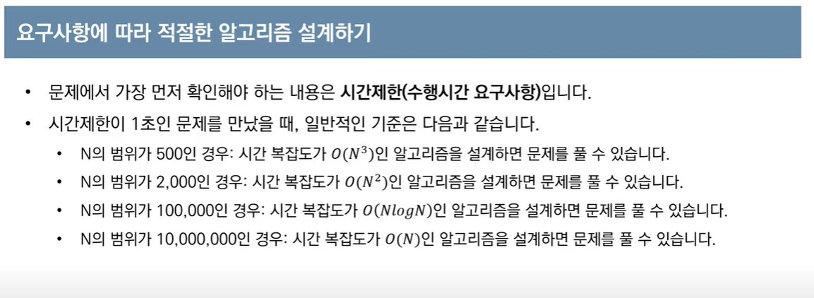

# 211203

## 관련 문제들

- [1920 수 찾기](https://www.acmicpc.net/problem/1920)
- [2750 수 정렬하기](https://www.acmicpc.net/problem/2750)
- [2751 수 정렬하기 2](https://www.acmicpc.net/problem/2751)
- [10989 수 정렬하기 3](https://www.acmicpc.net/problem/10989)

- [10815 숫자 카드](https://www.acmicpc.net/problem/10815)

## issue 정리

- 파이썬 자료구조 메서드 시간복잡도
  - [https://chancoding.tistory.com/43](https://chancoding.tistory.com/43)
  - `in` 연산자
    - `list` 는 O(N)
    - `set`은 O(1)

- O(n logn)인 퀵정렬, 머지소트  썼는데 자꾸 시간초과 🤔
  - 빠른 입력 `sys.stdin.readline()` 이용
  - 카운팅 정렬로 해결!
- 빠른 출력
  - `sys.stdout.writeline()`

- 정렬 알고리즘 정리

  

- N의 범위에 따른 시간복잡도 설계

  

